# Europe Travel Guide

**Europe Travel Guide** is a responsive web application that provides essential information about **18 European countries**, including landmarks, traditional food, and travel planning tips. Users can also leave advice/comments, but only if they are **registered and logged in**.

---

## Screenshots

*Home page - top section*

*Home page - bottom section*

*Intro page with country info*

*Monuments page*

*Trip plan page*

*Advice/comment section*

*Login page*

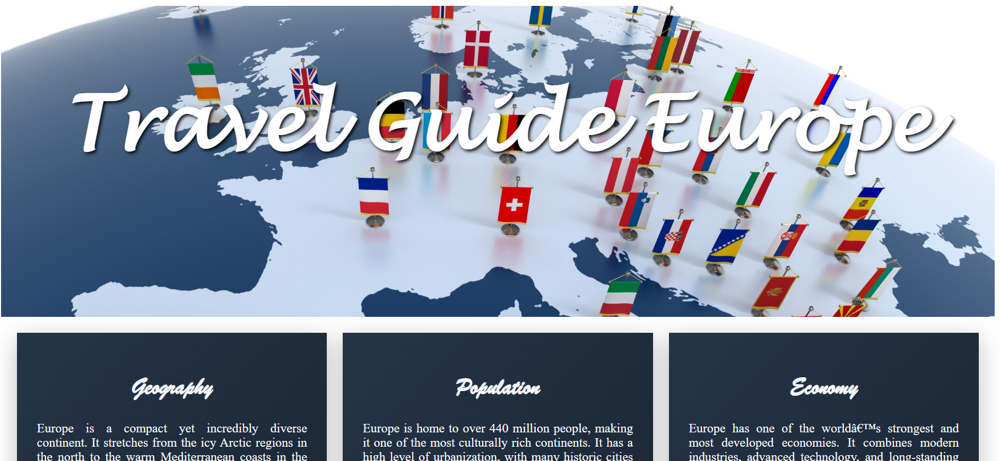
*Home page - top section*

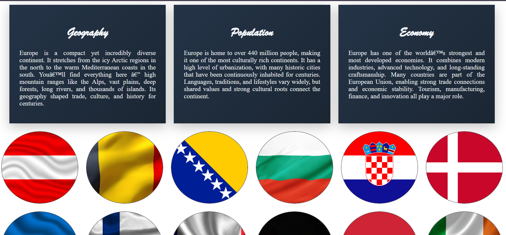
*Home page - middle section*

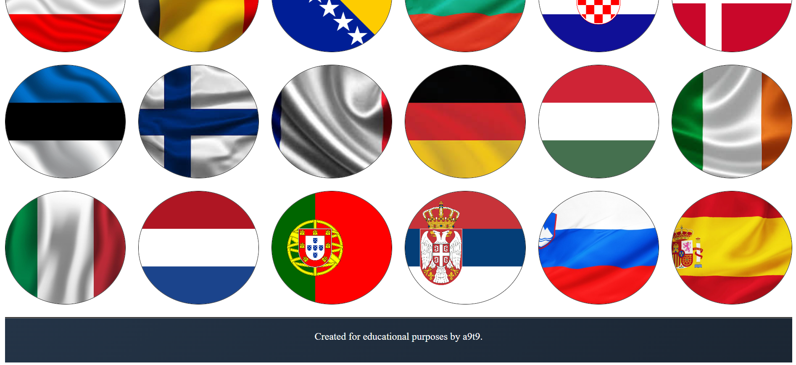
*Home page - bottom section*

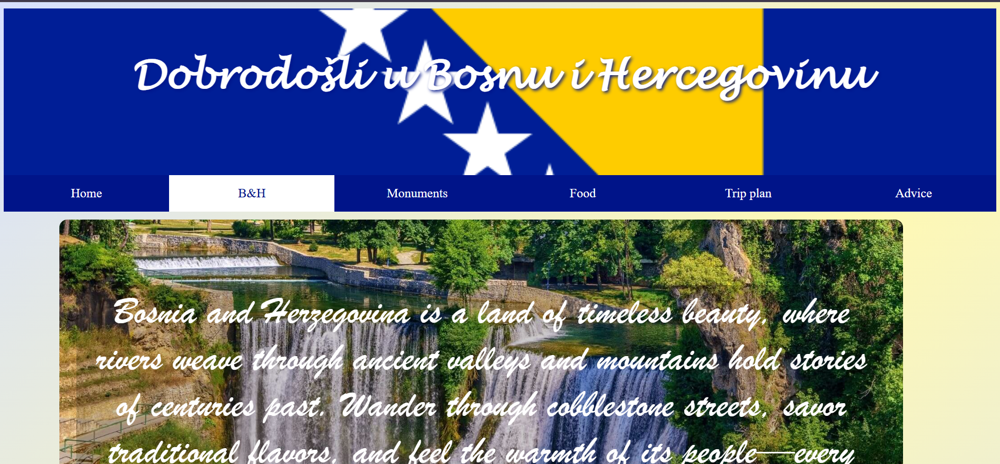
*Intro page with country info - top section*

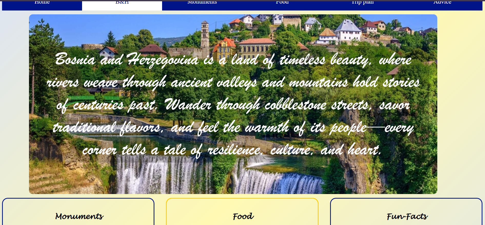
*Intro page with country info - middle 1 section*

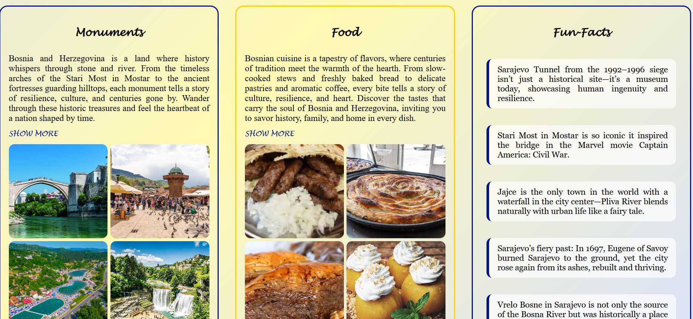
*Intro page with country info - middle 2 section*

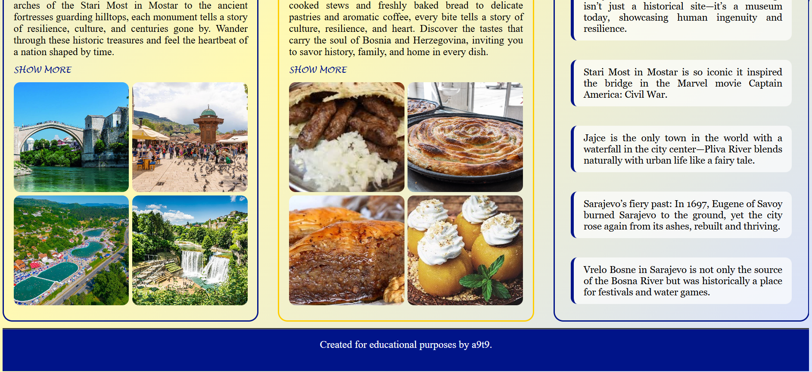
*Intro page with country info - bottom section*

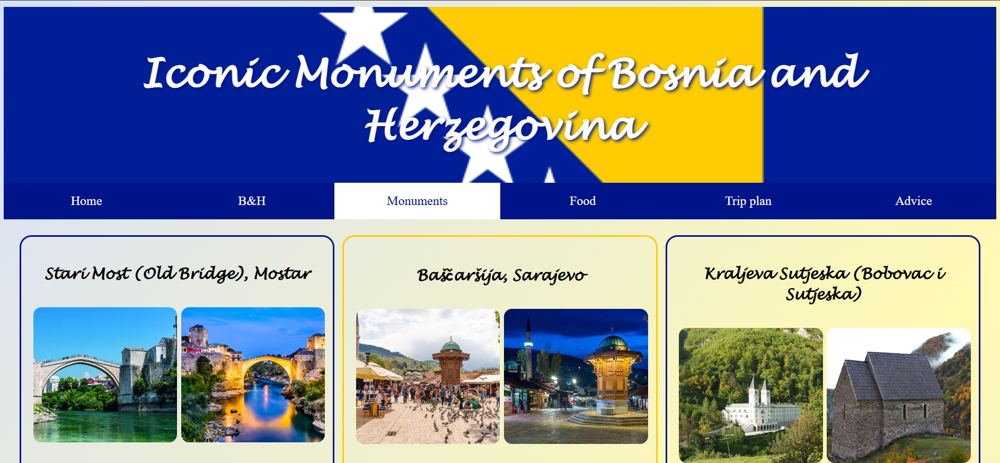
*Monuments page - Top Section*

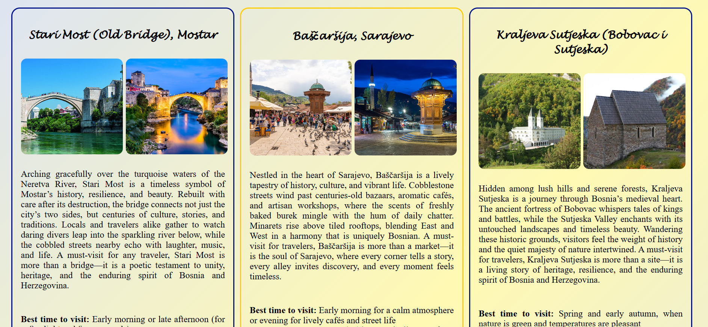
*Monuments page - Middle Section*

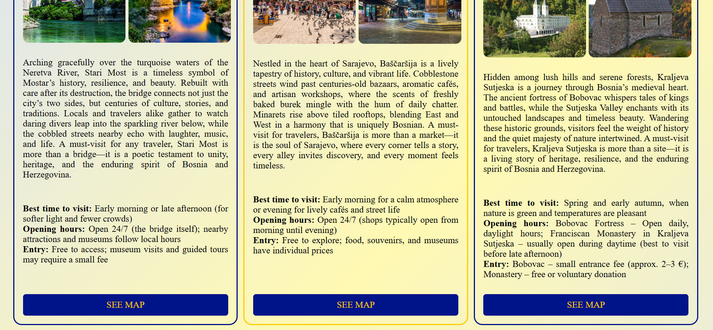
*Monuments page - Bottom Section*

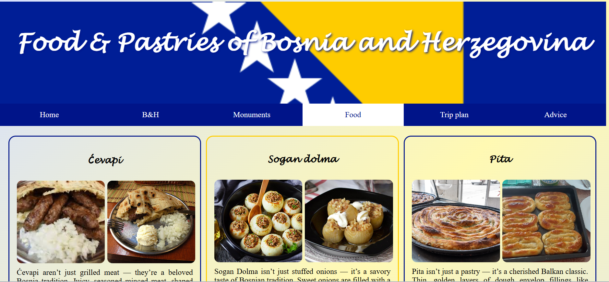
*Food page - Top Section*

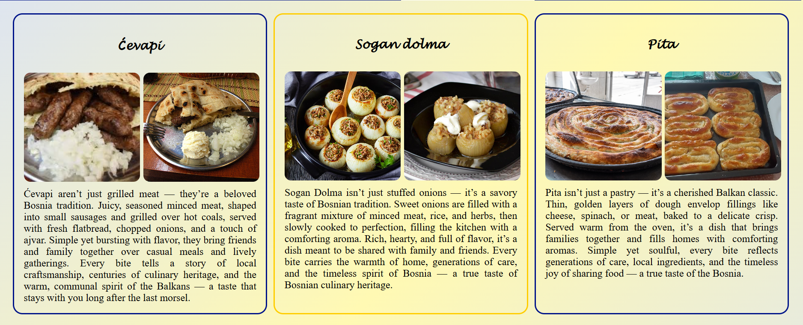
*Food page - Bottom Section*

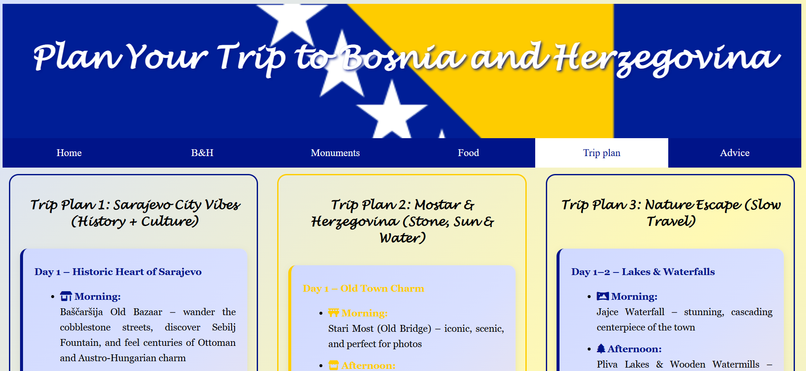
*Trip plan page - Top section*

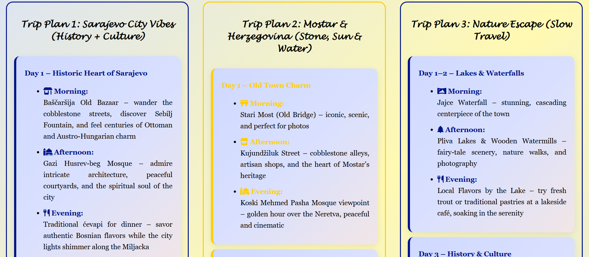
*Trip plan page - Middle section*

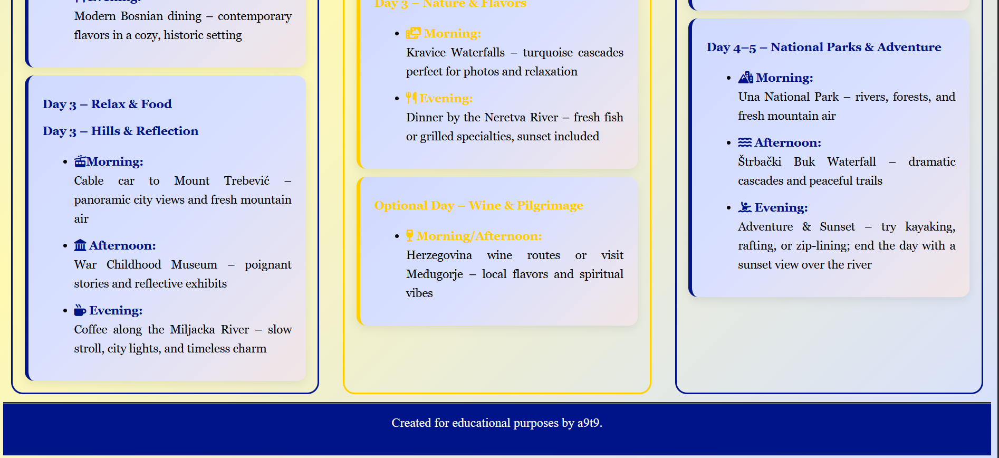
*Trip plan page - Bottom section*

*Advice/comment section - Top Section*

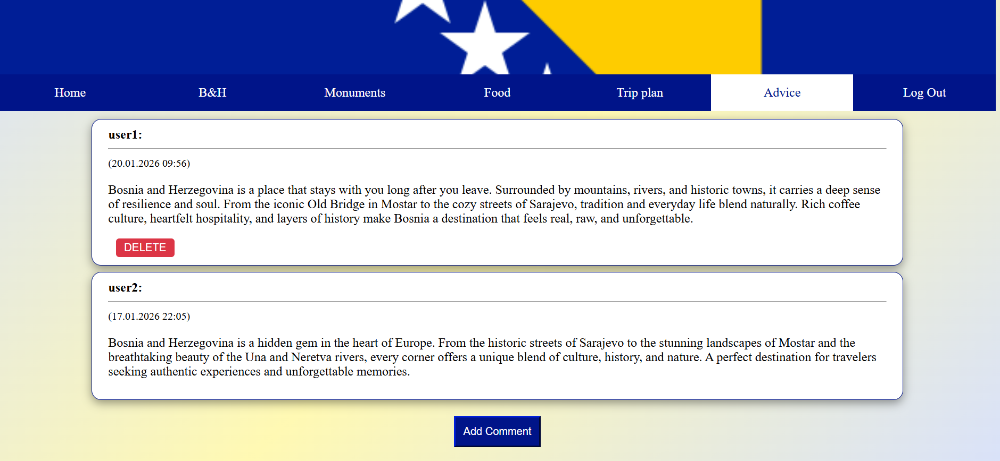
*Advice/comment section - Middle Section*

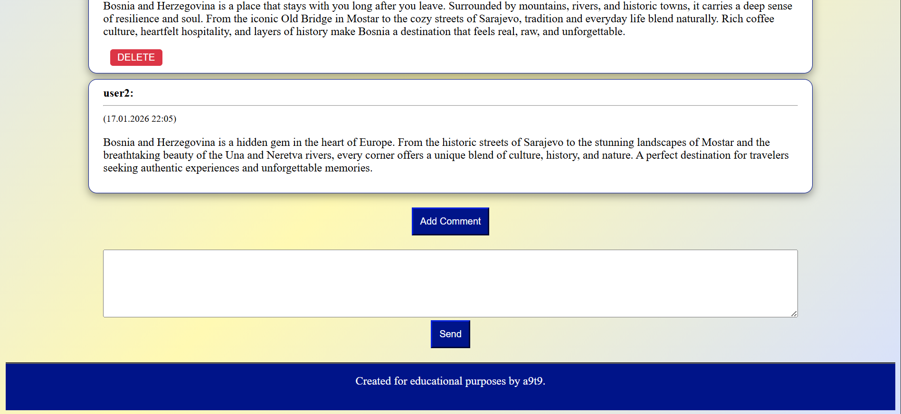
*Advice/comment section - Add Comment Section*

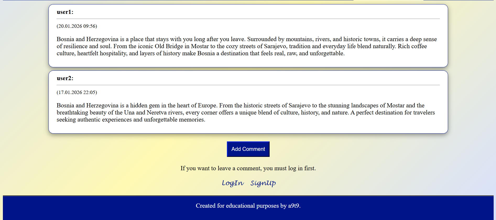
*Advice/comment section - Bottom Section*

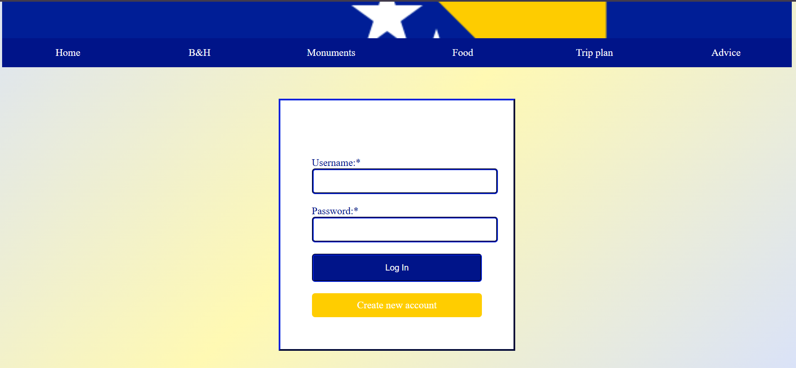
*Login page*

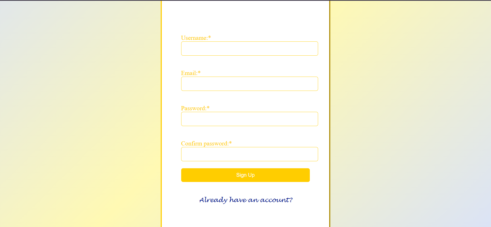
*SignUp page*

---

## Technologies

- **Backend:** PHP 8+
- **Database:** MySQL / MariaDB
- **Frontend:** HTML5, CSS3 (responsive design with media queries)
- **Security:** password_hash, prepared statements, htmlspecialchars, login rate limiting (max 3 attempts + 24h block)
- **Tools:** XAMPP (local development)

---

## Features

- User registration and login (with password hashing)
- Add comments/advice per country
- Delete your own comments
- Display comments with date and username
- Responsive design (mobile, tablet, desktop)
- 18 countries with their own pages, flags, and themed colors

---

## How to Run Locally

1. Install XAMPP (or WAMP/MAMP) and start Apache + MySQL
2. Copy the entire project to the `htdocs` folder (e.g., `C:\xampp\htdocs\TravelGuideEurope`)
3. Create the database `myDB` in phpMyAdmin (or let `config.php` create it)
4. Open in browser:
   - `http://localhost/TravelGuideEurope/home.html`
   - or `http://localhost/TravelGuideEurope/austria/austria_advice.php`

---

## Author

**Ada**  
Lukavac, Bosnia & Herzegovina  
 
[GitHub](https://github.com/a9t9Ada/Europe-Travel-Guide)

[LinkedIn](www.linkedin.com/in/adelina-tufekcic-3325b8373)

[LinkedIn](https://www.linkedin.com/in/adelina-tufekcic-3325b8373)

---
**This project is created for learning and portfolio purposes – strictly educational.**

---

## License

This project is licensed under the MIT License - see the [LICENSE](LICENSE) file for details.

